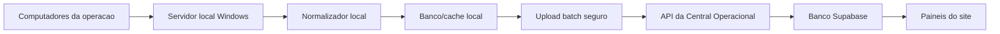

# Real Time Hours Capture

Documento de base para a futura implementacao de captura de horas em tempo real.

Este README existe para abrir um chat/projeto separado com contexto suficiente, sem depender do historico longo do projeto principal.

## Objetivo

Criar uma solucao para capturar, em tempo real ou quase real time, a atividade de horas dos colaboradores nos notebooks/PCs da operacao e enviar esses dados para a Central Operacional.

A ideia principal e:

- manter a captura dentro da rede/local da operacao;
- evitar que 120 maquinas enviem dados diretamente para o site ao mesmo tempo;
- usar um servidor local Windows como concentrador;
- identificar quem esta usando cada computador;
- consolidar eventos localmente;
- subir dados consolidados para o site por API segura;
- usar esses dados futuramente em paineis de horas, presenca, produtividade e status operacional.

## Problema que queremos resolver

Hoje existem dados de Real Time vindos de bases externas, mas eles nao necessariamente representam tempo real de trabalho do colaborador no computador.

Tambem existe o desafio de identidade:

- um mesmo notebook pode ser usado por pessoas diferentes;
- status de sistema externo pode ficar preso se a pessoa nao fechar a pagina;
- apenas saber que a maquina esta ligada nao prova que o colaborador esta trabalhando;
- capturar individualmente em cada maquina pode gerar muita carga e manutencao.

Por isso, a proposta e centralizar a captura em um servidor local.

## Arquitetura proposta



## Componentes

### 1. Computadores da operacao

Maquinas usadas pelos colaboradores.

Podem enviar ou expor sinais como:

- usuario logado no Windows;
- hostname;
- IP interno;
- horario de atividade;
- janela/app ativa, se permitido;
- heartbeat da sessao;
- eventos simples de atividade;
- tempo ocioso;
- identificador de login operacional, quando existir.

O ideal e evitar uma captura invasiva no MVP.

### 2. Servidor local Windows

Computador/servidor sempre ligado na mesma rede da operacao.

Responsabilidades:

- receber dados das maquinas;
- consolidar por colaborador, maquina e horario;
- manter cache local caso a internet/site esteja fora;
- aplicar regra de deduplicacao;
- enviar lotes para o site;
- registrar logs de erro;
- permitir manutencao sem depender de cada notebook.

### 3. Site Central Operacional

Recebe dados por API autenticada.

Responsabilidades:

- validar token;
- validar payload;
- salvar lote de importacao;
- salvar eventos/snapshots;
- preservar ultimo snapshot valido se upload falhar;
- expor dados em paineis futuros.

## Modelo de captura recomendado

Para MVP, evitar capturar "tudo" em detalhe. Comecar com snapshots periodicos.

Exemplo de frequencia:

- heartbeat local: a cada 1 minuto;
- consolidacao local: a cada 5 minutos;
- upload para o site: a cada 5 ou 10 minutos.

Payload consolidado sugerido:

```json
{
  "capturedAt": "2026-07-09T10:00:00-03:00",
  "source": "local-windows-server",
  "records": [
    {
      "hostname": "PC-OPERACAO-001",
      "windowsUser": "lucas",
      "wbLogin": "wb_lucasy",
      "employeeId": "optional",
      "ipAddress": "10.0.0.10",
      "isSessionActive": true,
      "idleSeconds": 120,
      "activeWindowTitle": "optional",
      "activeProcessName": "optional",
      "lastActivityAt": "2026-07-09T09:59:30-03:00"
    }
  ]
}
```

## Identificacao do colaborador

Pontos possiveis de identificacao:

- usuario do Windows;
- hostname da maquina;
- IP interno;
- login operacional digitado no agente local;
- de/para manual maquina -> colaborador;
- de/para usuario Windows -> WB/Login;
- autenticacao local simples no inicio do turno.

Como um computador pode ser compartilhado por varias pessoas, a regra mais segura e:

1. capturar usuario Windows/maquina;
2. cruzar com tabela de mapeamento;
3. permitir correcao manual no servidor local ou no site;
4. guardar a confianca da identificacao.

Exemplo:

```json
{
  "identityConfidence": "HIGH",
  "identitySource": "windows_user_mapping"
}
```

Valores possiveis:

- `HIGH`: usuario Windows mapeado diretamente ao WB/Login;
- `MEDIUM`: hostname/IP mapeado ao colaborador esperado;
- `LOW`: inferencia ou informacao incompleta;
- `UNKNOWN`: sem identificacao confiavel.

## Status operacional derivado

O objetivo nao e substituir cronograma, Real Time KAP ou billing. A captura local deve virar mais um sinal.

Status sugeridos:

- Online
- Online sem producao
- Ocioso
- Offline
- Fora do turno

Regra conceitual:

- escalado + producao recente = Online;
- escalado + sem producao, mas com sinal ativo = Online sem producao;
- escalado + ja produziu, mas ficou 1h sem producao = Ocioso;
- escalado + sem producao e sem sinal util apos tolerancia = Offline;
- nao escalado + producao ou sinal ativo = Fora do turno;
- nao escalado + sem producao e sem sinal = Offline.

Observacao:

Essas regras devem cruzar:

- cronograma;
- status cadastral;
- Real Time KAP;
- captura local;
- horarios de turno;
- tolerancias por LOB.

## APIs sugeridas

### POST `/api/realtime-hours/import`

Upload de snapshots consolidados do servidor local.

Autenticacao:

```http
Authorization: Bearer <REALTIME_HOURS_IMPORT_TOKEN>
```

Payload:

```json
{
  "source": "local-windows-server",
  "capturedAt": "2026-07-09T10:00:00-03:00",
  "records": []
}
```

Resposta:

```json
{
  "success": true,
  "batchId": "uuid",
  "rowsProcessed": 120,
  "rowsValid": 119,
  "rowsError": 1,
  "importedAt": "2026-07-09T10:00:05-03:00"
}
```

### GET `/api/realtime-hours/status`

Retorna o ultimo snapshot consolidado.

Uso futuro:

- painel operacional;
- auditoria;
- cruzamento com escala;
- analise de online/offline.

### GET `/api/realtime-hours/imports`

Historico de uploads do servidor local.

## Modelagem sugerida

### RealTimeHoursImportBatch

Campos sugeridos:

- `id`
- `source`
- `capturedAt`
- `importedAt`
- `status`
- `rowsTotal`
- `rowsValid`
- `rowsError`
- `errorSummary`
- `createdAt`

### RealTimeHoursRecord

Campos sugeridos:

- `id`
- `batchId`
- `capturedAt`
- `hostname`
- `windowsUser`
- `wbLogin`
- `employeeId`
- `ipAddress`
- `isSessionActive`
- `idleSeconds`
- `lastActivityAt`
- `activeProcessName`
- `activeWindowTitle`
- `identitySource`
- `identityConfidence`
- `rawData Json`
- `createdAt`

Indices sugeridos:

- `capturedAt`
- `wbLogin`
- `employeeId`
- `hostname`
- `batchId`
- `capturedAt + employeeId`
- `capturedAt + wbLogin`

## Retencao

Para evitar peso no banco:

- manter dados brutos por poucos dias;
- gerar agregados por janela;
- limpar snapshots antigos;
- preservar apenas o necessario para auditoria operacional.

Sugestao inicial:

- dados brutos: 3 a 7 dias;
- agregados de 5/10/15 minutos: 30 dias;
- agregados diarios: conforme necessidade de historico.

## Performance

Regras importantes:

- nao enviar evento por tecla/mouse;
- nao salvar dados excessivos;
- consolidar local antes de subir;
- enviar em batch;
- usar upsert/deduplicacao por `hostname + capturedAt`;
- nao carregar historico inteiro no painel;
- usar paginacao e filtros por data/LOB/supervisor;
- usar select minimo nas APIs.

## Seguranca e privacidade

Esse projeto deve ser tratado com cuidado.

Evitar no MVP:

- captura de tela;
- conteudo digitado;
- historico de navegador;
- URLs completas;
- dados pessoais desnecessarios;
- rastreamento minuto a minuto sem agregacao.

Preferir:

- status de atividade;
- tempo ocioso;
- processo/janela apenas se indispensavel;
- logs tecnicos minimizados;
- token de API por ambiente;
- rotacao de token;
- auditoria de uploads.

## Setup Windows previsto

No computador/servidor local:

- Node.js LTS;
- PowerShell 7, se necessario;
- Task Scheduler;
- pasta local de logs;
- arquivo `.env` local com tokens;
- script de instalacao;
- script de remocao;
- script de teste dry-run.

Variaveis previstas:

```env
REALTIME_HOURS_SITE_URL=https://eastriverbrasil.com
REALTIME_HOURS_IMPORT_TOKEN=trocar_por_token_seguro
REALTIME_HOURS_UPLOAD_ENABLED=true
REALTIME_HOURS_INTERVAL_MINUTES=5
```

Scripts futuros:

- `scripts/realtime-hours-agent.ps1`
- `scripts/realtime-hours-server.ps1`
- `scripts/install-realtime-hours-task.ps1`
- `scripts/uninstall-realtime-hours-task.ps1`
- `scripts/test-realtime-hours-upload.ps1`

## Fases de implementacao

### Fase 1 - Prova de conceito local

- criar payload manual;
- criar API de importacao;
- subir snapshot de teste;
- validar token;
- validar schema;
- salvar batch e records;
- exibir dados em endpoint simples.

### Fase 2 - Servidor local

- criar script Windows;
- coletar sinais basicos;
- consolidar snapshots;
- guardar cache local;
- subir para o site;
- criar logs.

### Fase 3 - Identidade

- mapear `windowsUser -> wbLogin`;
- mapear `hostname -> area/maquina`;
- resolver casos compartilhados;
- criar relatorio de registros sem identificacao.

### Fase 4 - Painel

- mostrar online/offline por LOB;
- cruzar com cronograma;
- mostrar fora do turno;
- mostrar ociosidade;
- filtrar por supervisor/LOB/turno.

### Fase 5 - Hardening

- retencao;
- auditoria;
- alertas de upload parado;
- rotacao de token;
- monitoramento de erro;
- instalador Windows melhorado.

## Pontos em aberto

Decisoes que precisam ser fechadas antes de codar tudo:

- qual sinal local sera considerado atividade valida;
- tolerancia para offline;
- tolerancia para ocioso;
- se podemos ler janela/processo ativo;
- se cada colaborador tera login proprio no Windows;
- se maquinas sao compartilhadas com frequencia;
- onde sera mantido o de/para usuario Windows -> WB/Login;
- frequencia ideal de upload;
- retencao desejada;
- quem tera acesso aos dados no site.

## Prompt sugerido para outro chat

Use este prompt para iniciar a implementacao em um chat separado:

```text
Quero implementar a captura de horas em tempo real conforme o documento docs/REALTIME_HOURS_CAPTURE_README.md.

Comece pela Fase 1:
- criar API POST /api/realtime-hours/import com token Bearer;
- criar modelos Prisma RealTimeHoursImportBatch e RealTimeHoursRecord;
- salvar batch e records em banco;
- criar GET /api/realtime-hours/status para retornar ultimo snapshot;
- criar script simples de teste para enviar payload fake local;
- nao criar painel completo ainda;
- nao capturar dados reais ainda;
- manter tudo isolado para nao afetar Real Time KAP, Billing, Performance ou Cronogramas;
- rodar typecheck/build ao final.
```

## Escopo que nao deve ser alterado nesta implementacao

Nao alterar:

- Billing;
- Requerido;
- Real Time KAP atual;
- Performance;
- Cronogramas;
- Horas Operacionais;
- Cadastro;
- Permissoes gerais;
- automacao KAP atual.

Foco:

Criar uma base tecnica separada para captura local de horas em tempo real.
